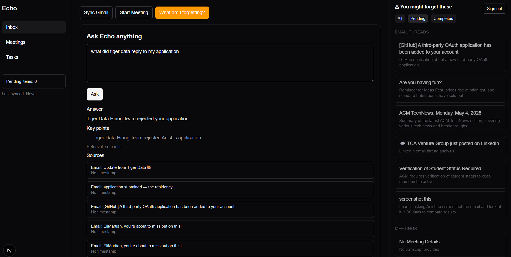

# Echo : Personal AI Memory Assistant

Echo is an AI assistant that remembers everything so you don't have to. It connects to your Gmail, transcribes your meetings, and answers questions about your past conversations, emails, and tasks — in natural language.

> "What did Rahul reply to my proposal?"  
> "What did we decide in yesterday's meeting?"  
> "What am I forgetting today?"

Echo knows. You don't have to.



---

## The Problem

You forget things. Everyone does.

- Emails you meant to follow up on
- Decisions made in meetings three weeks ago
- Tasks you promised someone you'd do
- Context from a conversation you half-remember

Note-taking apps need you to write things down by hand. CRMs are built for sales teams. Generic LLMs don't know your personal context.

**Echo does.**

---

## What Echo Does

**Email memory**  
Connect your Gmail once. Echo indexes your threads and lets you ask natural language questions about any email, sender, or thread.

→ "Did X reply to my last message?"  
→ "What was the invoice amount Priya sent?"  
→ "Summarize my last five emails from the design team"

**Meeting transcription + memory**  
Record a meeting. Echo transcribes it locally with Whisper, pulls out decisions and action items, and stores them as searchable memory.

→ "What did we decide about the launch date?"  
→ "Who was supposed to handle the API integration?"

**What am I forgetting?**  
Surfaces pending tasks, follow-ups, and commitments so fewer things slip through the cracks.

---

## How It Works

```text
Gmail API pulls your email threads
            ↓
Groq LLM summarizes, extracts tasks, and embeds context
            ↓
You ask a natural language question
            ↓
Echo retrieves relevant chunks from Supabase (pgvector + keyword fallback)
            ↓
Groq returns a concise, source-grounded answer

Meeting audio → FFmpeg → WAV → whisper.cpp (local, on your machine)
            ↓
Transcript chunked, embedded, stored in Supabase
            ↓
Queryable later via Ask Echo and related flows
```

---

## Tech Stack

| Layer | Technology |
| --- | --- |
| Frontend | Next.js (App Router) · React · TypeScript |
| Styling | Tailwind CSS |
| Auth + database | Supabase (Google OAuth · Postgres · pgvector) |
| Email | Gmail API (OAuth via Supabase session) |
| LLM | Groq API |
| Transcription | whisper.cpp (local) |
| Audio prep | FFmpeg (`ffmpeg-static` or system `FFMPEG_PATH`) |

**Why Groq?** Fast inference so answers feel instant.

**Why whisper.cpp locally?** Meeting audio stays on your machine until you choose to process it — privacy by default.

---

## Features

- Natural-language Q&A over synced Gmail threads
- Meeting recording, FFmpeg conversion, local Whisper transcription
- Persistent memory in Supabase Postgres (with vector search where configured)
- **What am I forgetting?** — surfaces risks and pending commitments
- **Ask Echo** — context-aware answers with retrieval
- Google sign-in via Supabase OAuth
- Optional local-only transcription pipeline

---

## Run Locally

**Prerequisites:** Node.js 18+, a [Supabase](https://supabase.com) project, Google Cloud project with **Gmail API** enabled (used with the scopes your app requests — configure OAuth consent and link the client in Supabase’s Google provider).

```bash
git clone https://github.com/Elimartain/Echo.git
cd Echo
npm install
cp .env.example .env.local
```

Fill in `.env.local` (see `.env.example` for the full list):

```env
NEXT_PUBLIC_APP_URL=http://localhost:3000
NEXT_PUBLIC_SUPABASE_URL=your_supabase_url
NEXT_PUBLIC_SUPABASE_ANON_KEY=your_supabase_anon_key
GROQ_API_KEY=your_groq_api_key
GROQ_MODEL=llama-3.3-70b-versatile
GROQ_MODEL_FALLBACK=llama-3.1-8b-instant

# Optional — meeting pipeline
WHISPER_CPP_BIN=/path/to/whisper
WHISPER_MODEL_PATH=/path/to/ggml-base.en.bin
FFMPEG_PATH=
```

Google **Client ID / Client Secret** for sign-in are configured in the **Supabase Dashboard** (Authentication → Providers → Google), not in this app’s `.env` file.

**Database:** run `supabase/schema.sql` in the Supabase SQL editor.

**Supabase Google OAuth:** enable the Google provider and add redirect URL `http://localhost:3000/auth/callback` (and your production URL when you deploy).

**Start the app:**

```bash
npm run dev
```

Open [http://localhost:3000](http://localhost:3000).

**Optional — whisper.cpp**

```bash
git clone https://github.com/ggerganov/whisper.cpp
cd whisper.cpp && make
bash ./models/download-ggml-model.sh base.en
```

Point `WHISPER_CPP_BIN` and `WHISPER_MODEL_PATH` at your binary and model. On Windows, set `FFMPEG_PATH` to a real `ffmpeg.exe` if the bundled path misbehaves.

---

## Project Structure

```text
src/
  app/                 # App Router routes + API routes
    api/               # /api/gmail/sync, /api/ask, meetings, tasks, etc.
    auth/              # OAuth callback + server actions
  components/          # UI (Echo shell, auth buttons)
  lib/                 # Gmail, Groq, embeddings, Supabase, Whisper helpers
  proxy.ts             # Session / routing middleware
supabase/
  schema.sql           # Postgres schema
public/                # Static assets (e.g. README demo image)
.env.example           # Environment template
```

---

## Why I Built This

I kept losing track of what people told me, what I promised, and what was urgent. Note-taking felt like extra work; calendars alone weren’t enough.

Echo is an experiment in **passive capture + active recall** — an AI layer that holds your context so you can ask in plain language instead of digging through inboxes and notes.

---

## Author

**Anish Raj** — B.Tech AI, USAR Delhi  
[LinkedIn](https://in.linkedin.com/in/anish-raj-3976b029b) · [GitHub](https://github.com/Elimartain)
